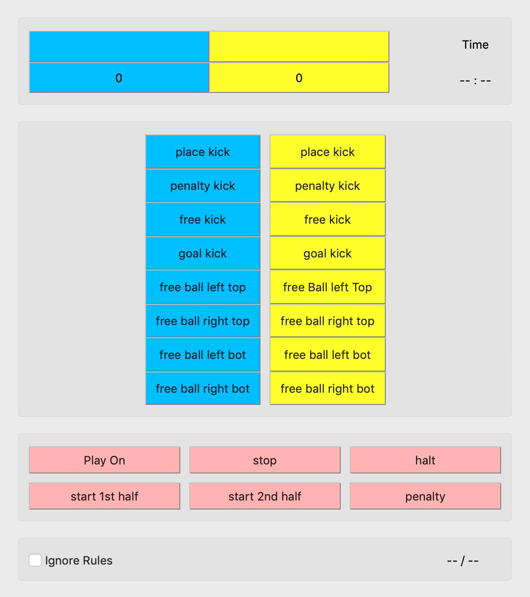

# Handy Controller

<p align="center">

</p>

## Usage

Game Controller is a manual referee that make the connections between AgentClients and the FIRASim.


## Installation

### Clone Sub Modules
```bash
git submodule update --recursive --init 
```

### creating virtualenv
#### Linux and macOS
```bash
pip3 install virtualenv
cd /path/to/handyController/directory
virtualenv env
source env/bin/activate
pip3 install -r requirements.txt
```

### run the app

#### Linux and macOS
```bash
cd src
python3 referee.py
```


